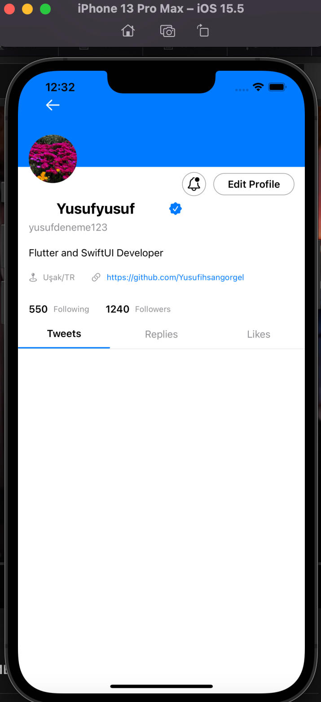

# SwiftUITwitterCloneFirebase
 SwifUI Twitter Clone Firebase with MVVM Architecture
 
SwifUI Twitter Clone Firebase with MVVM Architecture(iOS 15.5)
Register --> Finished 
Login --> Finished 
Home(all tweets sort by DateTime,Like Tweet) --> Finished 
Upload Tweet --> Finished
Search User --> Finished
Profile(tweet-likes) --> Finished
Messaging --> In Progress
Notifications --> Todo
Auth helpers(forgot password e.g.) --> Todo
 
 
 
 If your clone and usin this project , please add your GoogleService-Info file to project.

